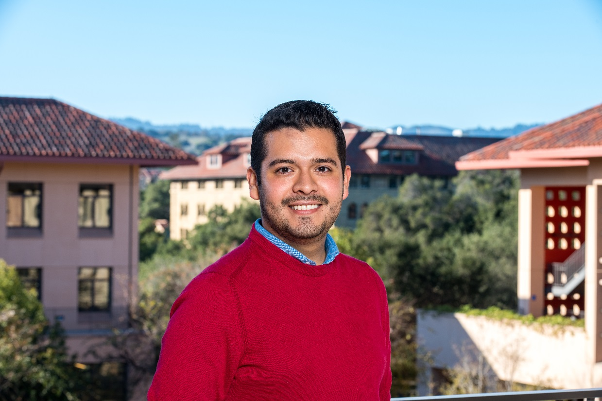

  

  <b>Salomé Aguilar</b>  es una estudiante de doctorado en economía en MIT. A ella le interesa la economía de la educación, como áreas de concentración estudia finanzas públicas y economía laboral. Antes de empezar el doctorado Salomé estudió una maestría en International Education Policy Analysis en Stanford y estudió su licenciatura en Economía en el ITAM. Durante su licenciatura y su maestría trabajó como asistente de investigación. Ella es de la Ciudad de México.

        

          <ul>
          <li>Contacto: <a href="mailto:saloagui@mit.edu">saloagui@mit.edu</a></li>
          </ul>
        

  

  <b>Luis Baldomero Quintana</b> se graduó del doctorado en Economía en la Universidad de Michigan y es profesor asistente en The College of William & Mary, en Virginia. Sus áreas de investigación son Comercio Internacional y Desarrollo Económico. Luis hizo la Licenciatura en Economía en el Tecnológico de Monterrey, Campus Monterrey, y trabajo en varias oficinas del Gobierno Federal. Creció en Tijuana durante el boom del Tratado de Libre Comercio, y siempre lo verás disfrutando de correr 5 km llueve, truene o relampagueé.

        

          <ul>
          <li>Contacto: <a href="mailto:labaldomeroqui@wm.edu">labaldomeroqui@wm.edu</a></li>
          <li>Página personal:   <a href="https://sites.google.com/view/luisbaldomeroquintana">https://sites.google.com/view/luisbaldomeroquintana</a></li>
          </ul>
        

  

  <b>Lilia</b> es estudiante de doctorado en economía en la universidad de Sussex. Su área de estudio es el mercado eléctrico pero también le interesan temas relacionados con cambio climático, mercado de petróleo y gas. Es maestra por la UNAM y licenciada por el Tec de Monterrey. Gracias a la pandemia se volvió ciclista urbana.

        

          <ul>
          <li>Contacto: <a href="mailto:l.garcia-manrique@sussex.ac.uk">l.garcia-manrique@sussex.ac.uk</a></li>
          <li>Página personal:   <a href="site.liliagama.com">site.liliagama.com</a></li>
          </ul>
        

  

  <b>José Ramón Morán</b>  es un estudiante de doctorado en economía en la Universidad de Michigan. Su área de investigación es la intersección entre comercio internacional y organización industrial, en particular, estudia cómo la incertidumbre y los tratados de libre comercio afectan el comportamiento de nuevos exportadores. José Ramón estudió su licenciatura y maestría en el ITAM y trabajó en la Dirección General de Investigación Económica del Banco de México. Nació y creció en Puebla y aún estando lejos, no se pierde un partido del América.

        

          <ul>
          <li>Contacto: <a href="mailto:moranvg@umich.edu">moranvg@umich.edu</a></li>
          </ul>
        

  

  <b>Mauricio Olivares</b> es un estudiante de doctorado en Illinois Urbana-Champaign. Su principal tema de investigación es econometría. Antes de empezar el doctorado estudió la licenciatura en el ITAM.
        

          <ul>
            <li>Página personal:   <a href="https://mauolivares.github.io/">https://mauolivares.github.io/</a></li>
          </ul>
        

  

    <b>Alain Pineda</b> es un estudiante de doctorado en economía en Stanford. Sus temas de investigación son economía laboral y desarrollo económico con un enfoque en informalidad laboral. Antes de empezar el doctorado Alain trabajó en la Dirección General de Investigación Económica del Banco de México. Obtuvo su licenciatura y maestría en economía por el ITAM. Alain es chilango de corazón pero creció en la CDMX, Morelia y Cuernavaca.
    

      <ul>
        <li>Contacto: <a href="mailto:alainpin@stanford.edu">alainpin@stanford.edu</a></li>
        <li>Página personal:   <a href="https://www.alainpineda.com">https://www.alainpineda.com</a></li>
      </ul>
    

  

  <b>Daniel Ramos</b> es un estudiante de doctorado en la escuela de Negocios de Harvard. Sus temas de investigación son economía urbana, comercio y desarrollo. Estudió una licenciatura en economía y una maestría en teoría economómica en el ITAM. Antes de aplicar al doctorado trabajó como asistente de investigación.

      

        <ul>
          <li>Contacto: <a href="mailto:danielramos@g.harvard.edu">danielramos@g.harvard.edu</a></li>
        </ul>
      

  

  <b>Ratzanyel Rincón</b> es estudiante entrante del doctorado en economía en la Universidad de British Columbia. Sus principales áreas de interés son la economía laboral, el desarrollo económico, y la microeconometría aplicada. Ratza estudió la licenciatura en Física y Matemáticas en el IPN y la maestría en Economía en El Colegio de México. Posteriormente, se unió a la Dirección General de Investigación Económica del Banco de México. Él es orgullosamente Atlixquense.  

      

        <ul>
          <li>Contacto: <a href="mailto:rrincon@colmex.mx">rrincon@colmex.mx</a></li>
        </ul>
      

  

  <b>Diana Sverdlin</b> es una estudiante de doctorado de economía en MIT interesada en estudiar temas de salud, informalidad y desarrollo económico. Estudió la licenciatura de Economía en el ITAM y antes de empezar el doctorado trabajó en el IMSS y posteriormente en Pemex.

      

        <ul>
          <li>Contacto: <a href="mailto:dianasl@mit.edu">dianasl@mit.edu</a></li>
        </ul>
      

  

  <b>Guillermo Verduzco</b>  estudia su doctorado en University of Notre Dame; sus principales áreas de investigación son Series de Tiempo Aplicadas, Política Monetaria y Fiscal, y Macroeconomía Internacional. Nació y creció al sur de la Ciudad de México, estudió la licenciatura en Economía en el CIDE y, despues de titularse, trabajó durante tres años en la Dirección General de Investigación Económica del Banco de México.

  Siempre rojinegro del Atlas y coyote de la Prepa 6 de la UNAM

        

          <ul>
          <li>Contacto: <a href="mailto:gverduzc@nd.edu">gverduzc@nd.edu</a></li>
          </ul>
        

